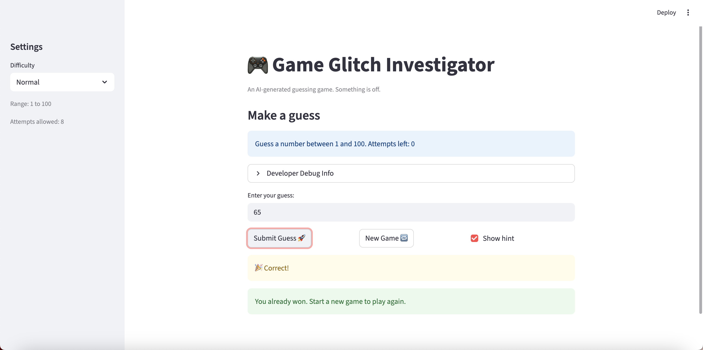

# 🎮 Game Glitch Investigator: The Impossible Guesser

## 🚨 The Situation

You asked an AI to build a simple "Number Guessing Game" using Streamlit.
It wrote the code, ran away, and now the game is unplayable. 

- You can't win.
- The hints lie to you.
- The secret number seems to have commitment issues.

## 🛠️ Setup

1. Install dependencies: `pip install -r requirements.txt`
2. Run the broken app: `python -m streamlit run app.py`

## 🕵️‍♂️ Your Mission

1. **Play the game.** Open the "Developer Debug Info" tab in the app to see the secret number. Try to win.
2. **Find the State Bug.** Why does the secret number change every time you click "Submit"? Ask ChatGPT: *"How do I keep a variable from resetting in Streamlit when I click a button?"*
3. **Fix the Logic.** The hints ("Higher/Lower") are wrong. Fix them.
4. **Refactor & Test.** - Move the logic into `logic_utils.py`.
   - Run `pytest` in your terminal.
   - Keep fixing until all tests pass!

## 📝 Document Your Experience

- [ ] Describe the game's purpose.
The game's purpose is to guess the secret number. Anything other than a number is not valid and the difficulty level can be adjusted.
- [ ] Detail which bugs you found.
One of the bugs I found was incorrect bounds for hints. For example, if 1 is not the secret number, "Go Higher" should always be printed which was not. Another bug I found was the "New Game" button did not work so the user could not start a new game. The lasy bug I found was the number of attempts not matching the given attempts on the sidebar which could be misleading for the user. 
- [ ] Explain what fixes you applied.
One fix I applied for the bugs consisted of changing the user's session status to accurately update during the game. Another fix I applied was adding script reruns to ensure the new game button worked properly. Additionally, I adjusted the min and max boundaries to ensure the guess bounds were accurate. 

## 📸 Demo Walkthrough

Describe your fixed game in numbered steps so a reader can follow along without watching a video:

1. User chooses a difficulty for the investigator.
2. User gets a set amount of attempts to guess the secret number.
3. If "Show Hint" is toggled the user will be prompted to guess higher or lower.
4. If the secret number is guessed, the game ends and the user is able to restart using the "New Game" button.
5. If the user runs out of attempts, the user will need to start a new game to continue.

**Screenshot** *(optional)*: 

## 🧪 Test Results

```
# Paste your pytest output here, e.g.:
# pytest tests/
# ========================= X passed in 0.XXs =========================
```

## 🚀 Stretch Features

- [ ] [If you choose to complete Challenge 4, describe the Enhanced UI changes here — a screenshot is optional]
